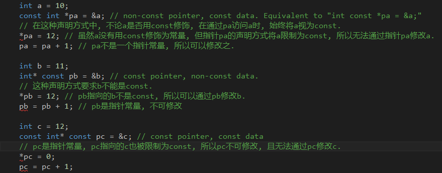

# item03: 尽可能使用const(Use const whenever possible)
## 1. const指针
- `const`出现在`*`左边：指针指向的变量为常量
- `const`出现在`*`右边：指针自身是常量, 指针指向的变量**不能**是常量 (不得修改指针使其指向别的东西, 但可以修改指针指向的东西的值)



## 2. 改善C++效率的方式: 以*pass by refernce-to-const*方式传递对象

## 3. 通过常量性(constness)实现成员函数重载
```cpp
class TextBook
{
public:
	TextBook(std::string text) :m_text(text) {}

	char& operator[](std::size_t pos)
	{
		std::cout << "non-const operator[] invoked" << std::endl;
		return m_text[pos];
	}

	// 后面这个const用于修饰函数自身, 表示调用此函数的TextBook对象是一个const对象.
	// c++允许成员函数通过常量性(constness)重载, 如果删除后面这个const就无法通过
	// 编译, 因为c++不允许通过返回值来重载.
	const char& operator[](std::size_t pos) const
	{
		std::cout << "const operator[] invoked" << std::endl;
		return m_text[pos];
	}
private:
	std::string m_text;
};

void printConst(const TextBook& c_tb)
{
	std::cout << c_tb[0] << std::endl; // const TextBook::operator[] invoked
}

void print(TextBook& tb)
{
	std::cout << tb[0] << std::endl; // TextBook::operator[] invoked
}

int main()
{
	TextBook tb("book");
	printConst(tb);
	print(tb);
}
```

## 4. 在const和non-const成员函数中避免代码重复
对之前的代码进行修改：

```cpp
class TextBook
{
public:
	TextBook(std::string text) :m_text(text) {}

	char& operator[](std::size_t pos)
	{
		std::cout << "non-const operator[] invoked" << std::endl;
		return const_cast<char&>( // 通过const_cast移除返回值的const属性
			static_cast<const TextBook&>(*this)[pos]); // 将non-const对象转换为const对象, 这个操作是安全的, 因为non-const函数本就可以对对象进行任何操作
	}

	const char& operator[](std::size_t pos) const
	{
		std::cout << "const operator[] invoked" << std::endl;
		// 下面这段边界检查的代码不应该在non-const版本的operator[]中重复出现!!
		if (pos < 0 || pos >= m_text.length())
		{
			std::cout << "pos out of bound.\n";
			return '?';
		}
		return m_text[pos];
	}
private:
	std::string m_text;
};

void printConst(const TextBook& c_tb)
{
	std::cout << c_tb[0] << std::endl; // const TextBook::operator[] invoked
}

void print(TextBook& tb)
{
	std::cout << tb[0] << std::endl; // TextBook::operator[] invoked
}

int main()
{
	TextBook tb("book");
	print(tb);
}
```

上述代码通过让non-const成员函数调用const成员函数来避免代码重复，但是反向做法——const调用non-const——是错误的，因为对象可能会因此被改动，而这不是const成员函数希望看到的.
