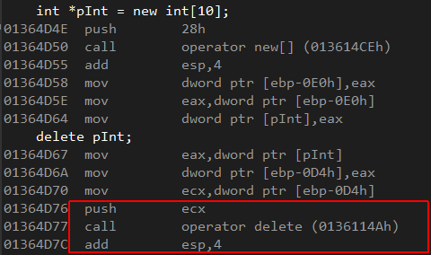

# item16 成对使用`new`和`delete`时要采取相同形式(Use the same form in corresponding uses of `new` and `delete`)
也就是`new-delete`和`new[]-delete[]`的配对使用，[《C++反汇编与逆向分析技术》笔记](https://github.com/l-iberty/Disassembly-And-RE-For-Cpp)中也有涉及。

## 1.基本类型的不配对使用
对于基本类型而言，如果使用`delete`去释放`new[]`分配的内存是不会有问题的。

最后调用`delete`函数时push进去的参数和之前分配的内存地址是同一个值。如果换成`delete[]`那么首先调用的就是`delete[]`函数，但是经过几个JMP和CALL最后还是会调用`delete`函数，并且push进去的参数也和直接调用`delete`时一致。所以对于基本类型，`new`和`delete`无所谓配对与否。

## 2.class类型的不配对使用
一般地，只有用户自己定义了析构函数才会在使用`new[]-delete`时触发异常，因为此时调用`delete`就不再是简单地释放内存了，还需要调用析构函数。为此，编译器会生成一些额外的代码。详见[《C++反汇编与逆向分析技术》笔记-ch10](https://github.com/l-iberty/Disassembly-And-RE-For-Cpp/tree/master/notes/ch10)