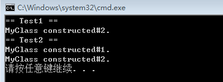
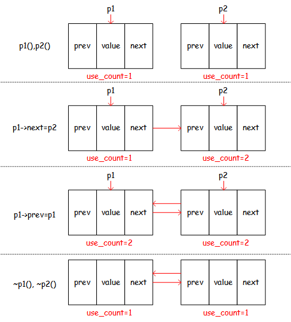

### 为什么用成员初始化列表会快一些（性能优势）？
成员初始化列表的性能优势主要在于*非内置类型成员变量*。对非内置类型成员变量，为了避免两次构造，推荐使用类构造函数初始化列表，测试代码如下：

```cpp
class MyClass {
public:
    MyClass() :var(0) {
        cout << "MyClass constructed#1.\n";
    }
    MyClass(int v) :var(v) {
        cout << "MyClass constructed#2.\n";
    }
private:
    int var;
};

class Test1 {
public:
    Test1() :myClass(10) {}
private:
    MyClass myClass;
};

class Test2 {
public:
    Test2() {
        myClass = MyClass(10);
    }
private:
    MyClass myClass;
};
int main()
{
    cout << "== Test1 ==\n";
    Test1 test1;
    cout << "== Test2 ==\n";
    Test2 test2;
    return 0;
}
```

测试结果:



可以看到，`Test1`只构造了一次`MyClass`，而`Test2`构造了两次。

但在某些情况下必须使用成员初始化列表：

- 成员类型是没有默认构造函数的类。
- const成员或者引用类型的成员。因为const对象或者引用类型只能初始化，不能赋值。

为什么成员初始化列表效率更高？

因为对于非内置类型，少了一次调用默认构造函数的过程。

### 构造函数或者析构函数中调用虚函数会怎样？
> 参见《Effective C++》Item09 不在构造和析构过程中调用虚函数

因为基类的构造/析构函数不会将虚函数的调用下降到派生类重载的虚函数，这么做的理由是显然的，首先对于构造函数，因为基类先于派生类构造，所以不能去使用尚未准备好的资源；其次对于析构函数，因为派生类先于基类析构，所以不能去使用已经被销毁的资源。至于为什么“基类的构造/析构函数不会将虚函数的调用下降到派生类重载的虚函数”，是因为构造函数一定是将虚表指针设置成自己的虚表地址，析构函数又会恢复虚表指针，参见[《C++反汇编与逆向分析技术》笔记](https://github.com/l-iberty/Disassembly-And-RE-For-Cpp)。

### 拷贝构造函数和赋值运算符的区别
参见《Effective C++》Item09 了解C\++默默编写并调用了哪些函数

### 虚函数和纯虚函数
纯虚函数相当于只提供一个接口让派生类实现，当然基类也可以给纯虚函数提供一份实现，但函数体必须定义于类的外部。

基类为什么要给纯虚函数提供一份实现？

类似于“缺省”的概念，如果派生类不想自己实现的话可以直接调用基类提供的“缺省实现”。

### 什么情况下会调用拷贝构造函数？
1. 用一个对象去构造另一个对象：`MyClass obj2 = obj1;`，相当于`MyClass obj2(obj1)`
2. 按值传参（把实参拷贝给形参）
3. 对象作为返回值：
```cpp
MyClass foo() {
    return MyClass(); // 返回临时对象，不会调用copy ctor
}
MyClass bar() {
    MyClass x;
    return x; // 调用copy ctor
}
```

### 三种继承方式的区别
1. `public`继承，基类的`public`成员在子类中还是`public`成员，基类的`protected`成员在子类中还是`protected`成员，基类的`private`成员不能被继承
2. `protected`继承，基类的`public`和`protected`成员和在子类变成`protected`成员，基类的`private`成员不能被继承
3. `private`继承，基类的`public`和`protected`成员和在子类变成`private`成员，基类的`private`成员不能被继承

### 手写智能指针实现
#### <font color="#DC143C">`auto_ptr`</font>
C++11之前的智能指针是`auto_ptr`，用以解决指针没有释放导致的内存泄漏，主要特点是：调用拷贝构造函数和赋值运算符时转移指针的所有权，简单实现如下：
```cpp
template<class T>
class my_auto_ptr {
private:
    mutable T* ptr;
public:
    explicit my_auto_ptr(T* p = 0) :ptr(p) {}
    my_auto_ptr(const my_auto_ptr& rhs) :ptr(rhs.ptr) {
        rhs.ptr = 0; // 如果不用mutable修饰ptr, 该语句无法通过编译, 因为const对象不可修改
    }

    my_auto_ptr<T>& operator=(const my_auto_ptr<T>& rhs) {
        if (this == &rhs) return *this;
        ptr = rhs.ptr;
        rhs.ptr = 0;
        return *this;
    }

    ~my_auto_ptr() {
        if (ptr) { delete ptr; }
    }

    T& operator*() const { return *ptr }
    T* operator->() const { return ptr; }
    T* get() const { return ptr; }
    T* release() const {
        T* tmp = ptr;
        ptr = 0;
        return tmp;
    }
};

int main()
{
    my_auto_ptr<MyClass> p1(new MyClass(1));
    my_auto_ptr<MyClass> p2 = p1; // 调用拷贝构造函数 `std::auto_ptr<MyClass> p2(p1)` 对象指针所有权由p1转移到p2
    assert(p1.get() == 0);
    assert(p2.get() != 0);
    std::cout << "p2->id=" << p2->id << "\n"; // output: p2->id=1

    p1 = p2; // 调用赋值运算符 `p1.operator=(p2)` 对象指针所有权由p2转移到p1
    assert(p1.get() != 0);
    assert(p2.get() == 0);
    std::cout << "p1->id=" << p1->id << "\n"; // output: p1->id=1
}
```

`auto_ptr`对象如果作为函数参数，那么在将实参拷贝给形参时会调用拷贝构造函数，实参将丢失指针所有权。至于`auto_ptr`对象是否可用作返回值，有些资料中说不能，但实际上这需要根据具体情况进行分析（例如编译器的实现），不能给出绝对的答案。

`auto_ptr`析构时调用的是`delete`，所以通常不适用于对象数组，像下面的代码就会在`auto_ptr`对象析构时抛异常：
```cpp
std::vector<int> *arr = new std::vector<int>[5];
my_auto_ptr<std::vector<int>> p(arr);
```

#### <font color="#DC143C">`shared_ptr`</font>
C++11或boost的`shared_ptr`，是基于引用计数的智能指针，直到内存的引用计数为零时才会被释放。

- 构造时：引用计数初始化为`1`
- 拷贝构造时：引用计数`+1`
- 赋值时：右值的引用计数`+1`, 左值的引用计数`-1`(如果减到零就释放内存), 最后用右值reset左值
- 析构时：引用计数`-1`(如果减到零就释放内存)

`shared_ptr`的简单实现：
```cpp
class MyClass {
public:
    int id;
    MyClass(int i) :id(i) {
        std::cout << "MyClass ctor. id=" << id << "\n";
    }
    MyClass(const MyClass& x) :id(x.id) {
        std::cout << "MyClass copy ctor. id=" << id << "\n";
    }
    ~MyClass() {
        std::cout << "MyClass dtor. id=" << id << "\n";
    }
    MyClass& operator=(const MyClass& x) {
        std::cout << "MyClass operator=\n";
        if (this == &x) return *this;
        id = x.id;
        return *this;
    }
};

class RefCount {
private:
    int uses;
public:
    RefCount() :uses(1) {}
    void incref() { ++uses; }
    void decref() { --uses; }
    int get_uses() const { return uses; }
    void delete_this() const { delete this; }
};

template<class T>
class my_shared_ptr {
private:
    T* ptr;
    RefCount* rep;
public:
    my_shared_ptr()
        : ptr(0), rep(0) {}
    explicit my_shared_ptr(T* p) 
        : ptr(p), rep(new RefCount()) {}
    my_shared_ptr(my_shared_ptr& rhs)
        : ptr(rhs.ptr), rep(rhs.rep) {
        rep->incref();
    }
    ~my_shared_ptr() { _Decref(); }

    my_shared_ptr& operator=(my_shared_ptr& rhs) {
        if (this == &rhs) return *this;
        rhs._Incref();
        _Decref();
        ptr = rhs.ptr, rep = rhs.rep;
        return *this;
    }

    T& operator*() const { return *ptr; }
    T* operator->() const { return ptr; }

    bool unique() const {
        return rep ? rep->get_uses() == 1 : 0;
    }
    int use_count() const {
        return rep ? rep->get_uses() : 0;
    }
    void _Incref() {
        if (rep) {
            rep->incref();
        }
    }
    void _Decref() {
        if (rep) {
            rep->decref();
            if (rep->get_uses() == 0) {
                delete ptr;
                rep->delete_this();
            }
        }
    }
};
int main()
{
    const int x = 1, y = 2;
    MyClass *objx = new MyClass(x);
    MyClass *objy = new MyClass(y);

    //std::shared_ptr<MyClass> p1(objx);
    my_shared_ptr<MyClass> p1(objx);
    // p1 --> [objx]
    // p1指向objx, objx的引用计数为1

    //std::shared_ptr<MyClass> p2 = p1;
    my_shared_ptr<MyClass> p2 = p1;
    // p1 --> [objx] <-- p2
    // p1和p2都指向objx, objx的引用计数为2

    //std::shared_ptr<MyClass> p3(objy);
    my_shared_ptr<MyClass> p3(objy);
    // p3 --> [objy]
    // p3指向objy, objy的引用计数为1

    //std::shared_ptr<MyClass> p4 = p3;
    my_shared_ptr<MyClass> p4(p3);
    // p3 --> [objy] <-- p4
    // p3和p4都指向objy, objy的引用计数为2

    p3 = p1;
    //           p3
    //           | 
    //           v
    // p1 --> [objx] <-- p2      [objy] <-- p4

    p4 = p1;
    //           p3
    //           | 
    //           v
    // p1 --> [objx] <-- p2      [objy]
    //           ^
    //           |
    //           p4
    // objy引用计数减为零, 析构之

    // p1,p2,p3,p4逐个析构, 最后当objx对象的引用计数为零时就被delete了
}
```

**循环引用造成的问题：**

引用计数有一个问题就是互相引用形成环，这样两个指针指向的内存都无法释放，除非手动打破循环。

如果在环状链式结构（如双向链表、循环链表）中使用`shared_ptr`就会因为*循环引用*而造成内存泄漏（这里指的“内存泄漏”不是分配后忘记释放，而是分配后无法释放）。

以双向链表为例：
```cpp
class node {
public:
    my_shared_ptr<node> prev;
    my_shared_ptr<node> next;
    int id;

    node(int i) :id(i) {
        std::cout << "node ctor. id=" << id << "\n";
    }
    node(const node& rhs) :id(rhs.id) {
        std::cout << "node copy ctor. id=" << id << "\n";
    }
    ~node() {
        std::cout << "node dtor. id=" << id << "\n";
        // 隐含代码:
        // ~prev(), ~next()
    }
};
int main()
{
    my_shared_ptr<node> p1(new node(1));
    my_shared_ptr<node> p2(new node(2));
    p1->next = p2;
    p2->prev = p1;
}
```


`shared_ptr`对象`p1`和`p2`析构后，`node1`(左)和`node2`(右)的引用计数为`1`，如果要释放`node1`就必须先释放`node2`(析构`node2`时，其成员变量`prev`和`next`亦被析构，通过`node2.prev`的析构可以让`node1`的引用计数减至零，从而释放`node1`)，但要释放`node2`就必须先释放`node1`，从而导致`node1`和`node2`无法被释放。

以循环链表为例：
```cpp
int main()
{
    my_shared_ptr<node> p1(new node(1));
    my_shared_ptr<node> p2(new node(2));
    my_shared_ptr<node> p3(new node(3));
    p1->next = p2;
    p2->next = p3;
    p3->next = p1;
    assert(p1.use_count() == 2);
    assert(p2.use_count() == 2);
    assert(p3.use_count() == 2);
}
```
也会因为同样的原理而使得3个`node`对象无法被释放。

#### <font color="#DC143C">`unique_ptr`</font>
C++11的`unique_ptr`独占所指的对象，一个对象只能被一个`unique_ptr`所指（通过禁止拷贝语义，只有移动语义来实现，即禁用拷贝构造函数和赋值运算符，只有移动构造函数和移动赋值运算符），否则会因为二次释放导致异常。

`unique_ptr`的简单实现：
```cpp
template<class T>
class my_unique_ptr {
private:
    T* ptr;
public:
    explicit my_unique_ptr(T* p) :ptr(p){}
    my_unique_ptr(my_unique_ptr&& rhs) :ptr(rhs.release()) {} // 移动构造函数

    my_unique_ptr& operator=(my_unique_ptr&& rhs) { // 移动赋值运算符
        if (&rhs == this) return *this;
        reset(rhs.release()); // *this接管rhs的内部指针
        return *this;
    }

    ~my_unique_ptr() { reset(); }

    T& operator*() const { return *ptr; }
    T* operator->() const { return ptr; }

    T* get() const { return ptr; }
    T* release() {
        // 放弃内部对象的所有权, 将内部指针置为null, 返回内部指针, 此指针指向的对象需要手动释放
        T* tmp = ptr;
        ptr = 0;
        return tmp;
    }
    void reset(T* p = 0) {
        // 销毁内部指针所指的对象, 将内部指针指向新对象
        if (ptr) {
            delete ptr;
        }
        ptr = p;
    }

    // 禁止拷贝语义
    my_unique_ptr(const my_unique_ptr&) = delete;
    my_unique_ptr& operator=(const my_unique_ptr&) = delete;
};

int main()
{
    const int x = 1;
    my_unique_ptr<MyClass> p1(new MyClass(x));
    my_unique_ptr<MyClass> p2(std::move(p1)); // 对象所有权转移到p2
    assert(p1.get() == 0);
    assert(p2->id == x);

    p1 = std::move(p2); // 对象控制权转移到p1
    assert(p2.get() == 0);
    assert(p1->id == x);
}
```

为了理解`unique_ptr`的移动语义，需要辨析如下几个概念：

##### <font color="#4682B4">左值 & 右值</font>
- 左值是可以放在赋值运算符左边可以被赋值的值；<font color="#FF0000">左值必须在内存中有实体</font>
- 右值是在赋值运算符右边可以被取出值赋给其他变量的值；<font color="#FF0000">右值可以在内存中也可以在CPU寄存器中</font>

例如，变量`i`既可以作为左值也可以作为右值，表达式`10`和`i+10`不能用做左值而只能用做右值，显然，我们不能对表达式赋值，`10=x`和`i+10=x`这样的语句是非法的。

##### <font color="#4682B4">左值引用 & 右值引用</font>
```cpp
int x = 10; // x是左值
int &a = x; // a是左值引用
//int &a = x + 10; 非法, x+10是一个右值

int &&b = x+1; // b是右值引用
int &&c = 5; // c是右值引用
//int &&rx = x; 非法, x是一个左值, 需使用std::move(x)转换语义
```

反汇编分析：
```cpp
    int &a = x; // 左值引用
 lea         eax,[ebp-0Ch]  
 mov         dword ptr [ebp-18h],eax  

    int &&b = x + 1; // 右值引用
 mov         eax,dword ptr [ebp-0Ch]  
 add         eax,1  
 mov         dword ptr [ebp-30h],eax  
 lea         ecx,[ebp-30h]  
 mov         dword ptr [ebp-24h],ecx  
    int &&c = 5; // 右值引用
 mov         dword ptr [ebp-48h],5  
 lea         eax,[ebp-48h]  
 mov         dword ptr [ebp-3Ch],eax  
```
右值引用实际上就是将表达式的值保存在栈上，然后取其地址，本质上和左值引用没有区别。

##### <font color="#4682B4">std::move</font>
`std::move(t)`无条件地将参数`t`(`t`可以是左值、左值引用、右值、右值引用)转换成右值引用，代码如下：
```cpp
template<class _Ty> inline
    typename remove_reference<_Ty>::type&&
        move(_Ty&& _Arg) _NOEXCEPT
    {   // forward _Arg as movable
    return ((typename remove_reference<_Ty>::type&&)_Arg);
    }
...
template<class _Ty>
    struct remove_reference
    {   // remove reference
    typedef _Ty type;
    };
// 模板偏特化, 参见《STL源码剖析》-p88
template<class _Ty>
    struct remove_reference<_Ty&>
    {   // remove reference
    typedef _Ty type;
    };

template<class _Ty>
    struct remove_reference<_Ty&&>
    {   // remove rvalue reference
    typedef _Ty type;
    };
```
`std::move`涉及到引用折叠、模板参数推导、无名右值引用等复杂概念，此处从略。

`auto_ptr`在“拷贝”的时候其实并非严格意义上的拷贝。“拷贝”是要保留源对象不变，并基于它复制出一个新的对象出来。但`auto_ptr`的“拷贝”却会将源对象“掏空”，只留一个空壳，实际上是一次资源所有权的转移。`auto_ptr`的危险之处在于看上去是复制，实际上却是转移，C++11中被`unique_ptr`替换，而`unique_ptr`就是用move语义实现的。

### C++的四种强制转换
- `static_cast`
- `dynamic_cast`
- `const_cast`
- `reinterpret_cast`

### C++11新特性
- `unordered_map`(和`hash_map`没有本质区别, 都是基于hashtable)
- `shared_ptr`, `unique_ptr`
- 移动构造函数, 移动赋值运算符, std::move, std::forward

### 为什么模板类（函数）的声明和实现要一起放在h文件里？
如果不使用模板：
`foo.h`=>
```cpp
int foo(int x, int y);
```

`foo.cpp`=>
```cpp
int foo(int x, int y) {
    return x+y;
}
```

`main.cpp`=>
```cpp
#include "foo.h"

int main() {
    int x=0, y=1;
    foo(x,y);
}
```

类型是明确的，编译链接正常进行。

如果使用模板：
`foo.h`=>
```cpp
template<class T>
T foo(T x, T y);
```

`foo.cpp`=>
```cpp
template<class T>
T foo(T x, T y) {
	return x + y;
}
```

`main.cpp`=>
```cpp
#include "foo.h"

int main() {
    int x=0, y=1;
    foo<int>(x,y);
}
```

由`main.cpp`编译到目标文件`main.o`的过程中，模板被特化，编译正常。但是编译`foo.cpp`的时候编译器不知道如何特化模板，这是因为编译是以单个文件为单位的。最终链接器无法找到`main.o`中的`foo<int>()`的实现，导致**链接错误**
